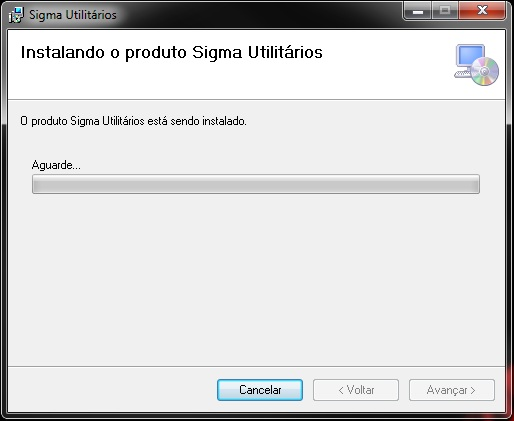

### Instalação

* 1- Para instalar a barra de ferramentas Ferramentas SIGMA, acione o botão Setup;

* 2- Logo em seguida, na tela de boas-vindas, clique em Avançar;

* 3- Na tela *Selecionar Pasta de Instalação*, cliquei em **Procurar** e escolha o caminho em que será instalado o aplicativo. Logo após, acione o botão Avançar;

* 4- Após ter informado a pasta destino, confirme a instalação acionando o botão **Avançar**;

* 5- Na tela *Instalando o produto Sigma Utilitários*, aguarde até o final da instalção;

* 6- Se tudo estiver ocorrido bem na instalção, a tela **Instalação Concluida** aparecerá informando êxito. Clique em **Fechar**.